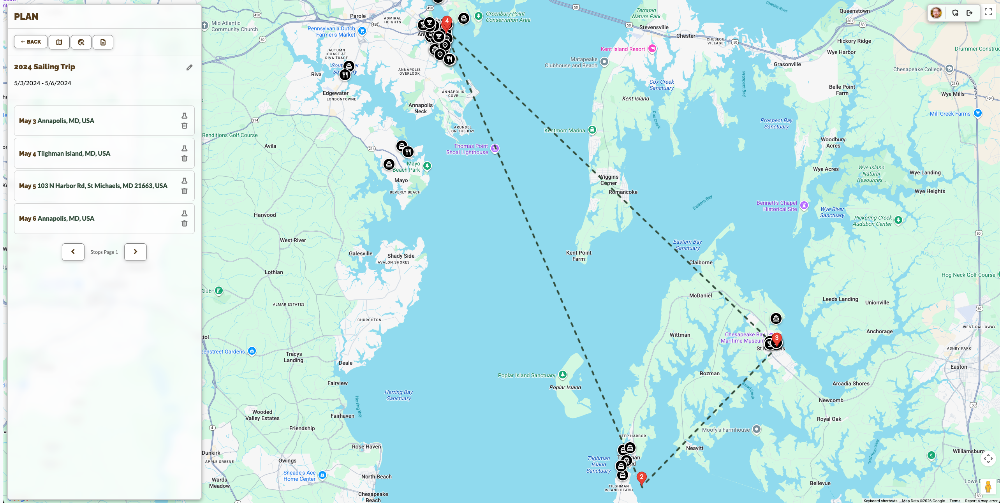
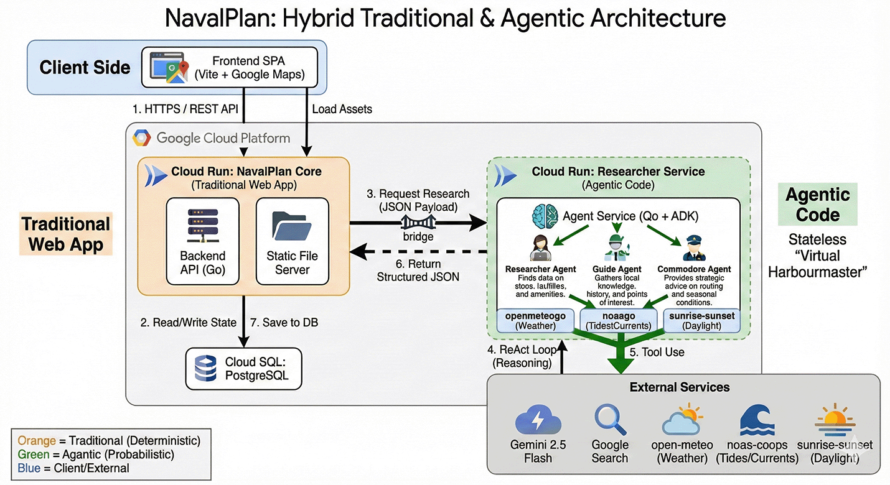

# NavalPlan



NavalPlan is a web application for planning sailing voyages, researching stops, and discovering new destinations using AI agents.

## Prerequisites

Before you begin, ensure you have the following installed:

*   **Go** (1.21 or later)
*   **Node.js** (20 or later) & **npm**
*   **Podman** (for running the PostgreSQL database). *Note: You can replace `podman` with `docker` in the Makefile if you prefer Docker.*
*   **Google Cloud SDK** (`gcloud`) - Optional, for deployment and cloud-specific tasks.

## Getting Started

1.  **Clone the repository:**
    ```bash
    git clone https://github.com/your-username/navalplan.git
    cd navalplan
    ```

2.  **Run Setup:**
    This command will create your `.env` file from the example and install all Go and Node.js dependencies.
    ```bash
    make setup
    ```

3.  **Configure Environment:**
    Open the newly created `.env` file and fill in the required values:
    *   `GOOGLE_CLIENT_ID` & `GOOGLE_CLIENT_SECRET`: Create these in the [Google Cloud Console](https://console.cloud.google.com/apis/credentials).
    *   `NAVALPLAN_FRONTEND_MAPS_API_KEY` & `NAVALPLAN_BACKEND_MAPS_API_KEY`: Get API keys from [Google Maps Platform](https://developers.google.com/maps).
    *   `NAVALPLAN_MAP_ID`: Create a Map ID in Google Maps Platform (for vector maps/styling).
    *   `NAVALPLAN_SYSTEM_KEY`: Generate a secure random string for system-level API access.

4.  **Start the Database:**
    This uses Podman to start a PostgreSQL container and applies migrations/seeds.
    ```bash
    make db-start
    ```

5.  **Run the Application:**
    This starts the Backend, Frontend (build), and the Researcher Agent.
    ```bash
    make dev
    ```
    Access the application at `http://localhost:8080`.

## Development Commands

*   `make run-backend`: Runs only the Go backend (requires `static.min` to exist).
*   `make run-frontend`: Runs the frontend in dev mode (Vite).
*   `make run-agent`: Runs the Researcher Agent.
*   `make db-reset`: Stops, restarts, and reseeds the database.
*   `make migrate-up`: Applies pending database migrations.
*   `make migrate-create`: Creates a new migration file.

## Testing

*   **Run all tests:**
    ```bash
    make test
    ```
*   **Backend tests only:**
    ```bash
    make test-backend
    ```
*   **Frontend tests only:**
    ```bash
    make test-frontend
    ```

## Architecture



*   **Backend**: Go (Standard Library + `chi`-style routing without the framework).
*   **Frontend**: Vanilla JS / ES Modules (no framework) bundled with Vite.
*   **Database**: PostgreSQL.
*   **Agents**: Go-based agents using Google Gemini models.

## Deployment

For detailed instructions on setting up Google Cloud infrastructure and deploying the application, see the [Deployment Guide](docs/DEPLOYMENT.md).

Quick commands:
*   `make setup-infra`: Provision GCP resources (APIs, SQL, Buckets).
*   `make setup-secrets`: Configure application secrets.
*   `make deploy-backend`: Deploys the main application.
*   `make deploy-agent`: Deploys the researcher agent.
*   `make deploy-sql`: Initializes the production database.
