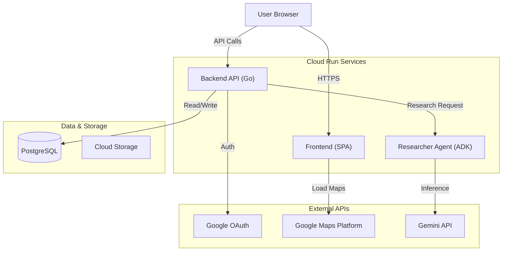

# NavalPlan Application Overview

NavalPlan is a web application designed for sailing voyage planning. It allows skippers to plan day-by-day itineraries, research anchorages and marinas using AI agents, and manage voyage details. It acts as a "future-facing" counterpart to *Navallog*, which logs past voyages.

## 1. Core Purpose

*   **Voyage Planning:** Create and manage multi-day trips with specific start and end dates.
*   **AI Research:** Uses a "Virtual Harbourmaster" agent to research weather, tides, and facilities for specific locations and dates.
*   **Logbook Generation:** (Planned) Export plans into professional Google Doc logbooks.
*   **Sharing:** Share read-only itineraries with friends and family via secure links.

## 2. High-Level Architecture

The application follows a modern, cloud-native microservices architecture deployed on Google Cloud Platform.

## 3. Technology Stack

### Frontend
*   **Framework:** Vanilla JavaScript (ES Modules). No heavy framework like React or Vue.
*   **Build Tool:** [Vite](https://vitejs.dev/) for bundling and hot-reloading.
*   **Maps:** [Google Maps JavaScript API](https://developers.google.com/maps/documentation/javascript) (via `@googlemaps/js-api-loader`).
    *   *Note: Recently migrated from Mapbox GL JS.*
*   **UI/Styling:** Custom CSS.
*   **Testing:** Jasmine.

### Backend
*   **Language:** Go (1.25+).
*   **Web Server:** Standard library `net/http` with custom router (Chi-style, dependency-free).
*   **Database Access:** 
    *   `github.com/jackc/pgx/v5` (Driver)
    *   `github.com/jmoiron/sqlx` (Extensions)
*   **Logging:** `github.com/charmbracelet/log`
*   **Authentication:** Google OAuth 2.0.

### Researcher Agent (Microservice)
*   **Framework:** [Agent Developer Kit (ADK)](https://github.com/googleapis/agent-developer-kit) for Go.
*   **Model:** Google Gemini (e.g., `gemini-2.0-flash-exp`).
*   **Function:** Stateless REST service that accepts a `(lat, lon, date)` and returns structured JSON (weather, tides, facilities).
*   **Tools:** Google Search (for verifying marina details/VHF channels).

### Infrastructure (Google Cloud)
*   **Compute:** Cloud Run (Serverless containers for Backend and Agent).
*   **Database:** Cloud SQL (PostgreSQL 15).
*   **Storage:** Cloud Storage (for logs and backups).
*   **CI/CD:** Cloud Build (defined in `cloudbuild.yaml` and `cloudbuild-agent.yaml`).
*   **Secrets:** Secret Manager.
    *   *Note: For `NAVALPLAN_FRONTEND_MAPS_API_KEY` and `NAVALPLAN_BACKEND_MAPS_API_KEY`, you can use the same key during development. However, for production, it is strongly recommended to use separate keys with distinct restrictions (Frontend restricted by HTTP Referrer, Backend by IP address).*

## 4. Key Workflows & Integration

### A. The "Monolithic" Dev Experience
In production, the Go backend serves the compiled frontend assets (`static.min`). This simplifies deployment to a single URL.
*   **Development:** `make dev` runs the Backend (Go), Agent (Go), and Frontend (Vite) concurrently. Vite proxies API requests to the Go backend.
*   **Production:** `make run` builds the frontend to `code/app/backend/static.min` and the Go server serves these static files alongside its API routes.

### B. The Research Loop
1.  **Trigger:** User clicks a location on the map and selects a date.
2.  **Request:** Frontend POSTs to `/api/v1/stops/{id}/research`.
3.  **Delegation:** Backend authenticates the request and forwards it to the private **Researcher Agent** service.
4.  **Processing:** The Agent uses Gemini to "reason" about the location and date, calling tools (Google Search) to find specific facility info (VHF channels, holding ground).
5.  **Response:** The Agent returns a structured JSON "Briefing."
6.  **Storage:** Backend saves this briefing to the `briefings` table in Postgres.
7.  **Update:** Frontend polls or receives the updated state to display markers on the map.

### C. Authentication
*   Session-based authentication using HTTP-only cookies.
*   Users sign in via Google.
*   The system creates a `User` record linked to their Google ID.
*   Internal service-to-service communication (Backend -> Agent) is secured via IAM (Cloud Run invoker roles) or shared system keys in local dev.
